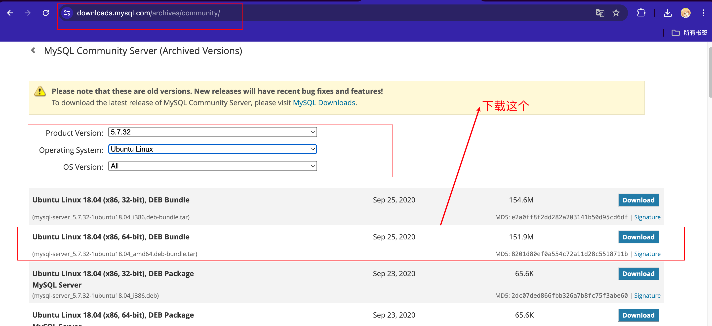
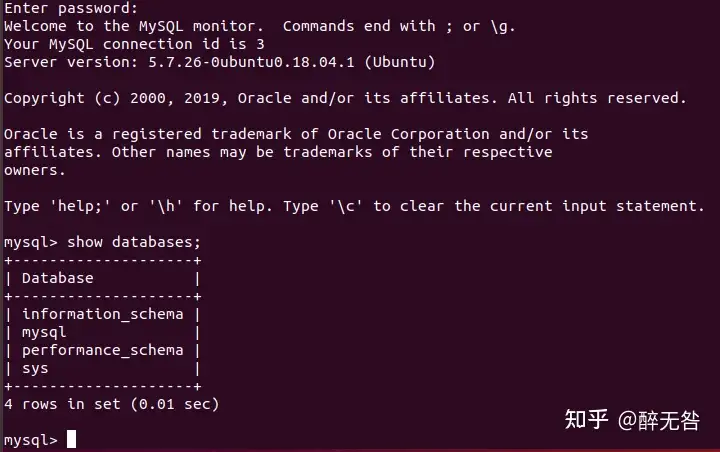
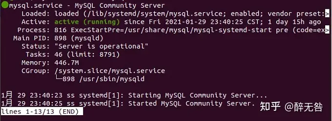

# [Ubuntu20.04中安装MySQL 5.7.x](https://zhuanlan.zhihu.com/p/348317883)

## 1. 下载安装包

 

## 2. 解压安装包

自己新建一个文件夹，将压缩包放在里面并解压：

```bash
tar -xvf mysql-server_5.7.32-1ubuntu18.04_amd64.deb-bundle.tar
```

`mysql-server_5.7.32-1ubuntu18.04_amd64.deb-bundle.tar`这个是你下载的文件，不一定叫这个名字。

## 3. 安装MySQL5.7.32

1.更新依赖源及安装libaio1、libtinfo5依赖

```bash
sudo apt-get update
sudo apt-get upgrade
sudo apt-get install libaio1
sudo apt-get install libtinfo5
```

2.按下列顺序安装（提示缺少依赖可更换顺序）

```bash
sudo dpkg -i mysql-common_5.7.32-1ubuntu18.04_amd64.deb
sudo dpkg-preconfigure mysql-community-server_5.7.32-1ubuntu18.04_amd64.deb #此步需要输入数据的root密码
sudo dpkg -i libmysqlclient20_5.7.32-1ubuntu18.04_amd64.deb
sudo dpkg -i libmysqlclient-dev_5.7.32-1ubuntu18.04_amd64.deb
sudo dpkg -i libmysqld-dev_5.7.32-1ubuntu18.04_amd64.deb
sudo dpkg -i mysql-community-client_5.7.32-1ubuntu18.04_amd64.deb
sudo dpkg -i mysql-client_5.7.32-1ubuntu18.04_amd64.deb
sudo dpkg -i mysql-common_5.7.32-1ubuntu18.04_amd64.deb
```

3.继续安装依赖

```bash
sudo apt-get -f install
sudo apt-get -f install libmecab2
```

4.安装mysql－server

```bash
sudo dpkg -i mysql-community-server_5.7.32-1ubuntu18.04_amd64.deb
sudo dpkg -i mysql-server_5.7.32-1ubuntu18.04_amd64.deb
```

5.检测安装

```bash
mysql -u root -p
```

Enter password:输入前面设置的密码，就能够进入mysql数据库。

 

## 4. 配置MySQL

1.初始化配置

```bash
sudo mysql_secure_installation
```

2.配置说明

```bash
#1
VALIDATE PASSWORD PLUGIN can be used to test passwords...
Press y|Y for Yes, any other key for No: N (选择N，不会进行密码的强校验)

#2
Please set the password for root here...
New password: (输入密码)
Re-enter new password: (重复输入)

#3
By default, a MySQL installation has an anonymous user allowing anyone to log into MySQL without having to have a user account created for them...
Remove anonymous users? (Press y|Y for Yes, any other key for No) : N (选择N，不删除匿名用户)

#4
Normally, root should only be allowed to connect from，'localhost'. This ensures that someone cannot guess at the root password from the network...
Disallow root login remotely? (Press y|Y for Yes, any other key for No) : Y (我的选项，选择N，允许root远程连接)

#5
By default, MySQL comes with a database named 'test' that anyone can access...
Remove test database and access to it? (Press y|Y for Yes, any other key for No) : N (选择N，不删除test数据库)

#6
Reloading the privilege tables will ensure that all changes made so far will take effect immediately.
Reload privilege tables now? (Press y|Y for Yes, any other key for No) : Y (选择Y，修改权限立即生效)
```

3.检查mysql服务状态

```bash
systemctl status mysql.service
```

出现下面界面说明安装成功。

 

至此MySQL5.7.32已经安装成功。

## 5. 安装和卸载其他版本

+ [ubuntu20.04安装mysql8](https://blog.csdn.net/m0_53721382/article/details/128943162)
+ [Ubuntu20.04卸载MySQL8](https://www.cnblogs.com/zhangxuel1ang/p/13456116.html)

