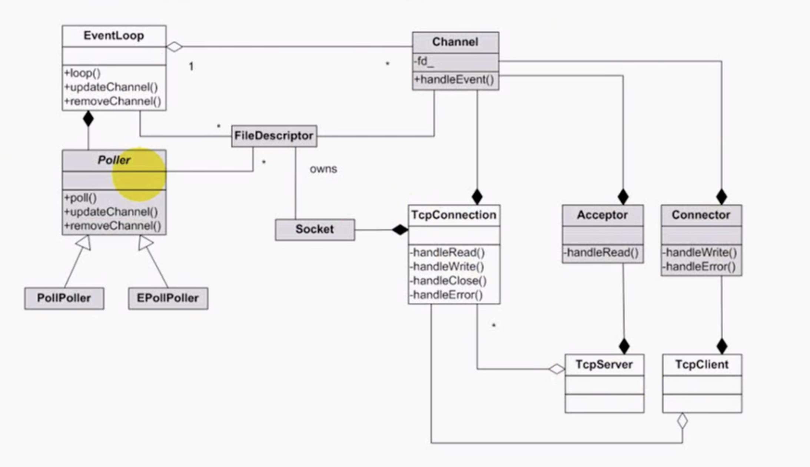

# WebServer

## 1. muduo的并发模型

muduo使用非阻塞的poll/epoll轮询监听（Reactor）有无SOCKET读写IO事件，将IO事件的处理回调函数分发到线程池中，实现异步返回结果。在多线程编程模型中采用了：

> One loop per thread + thread

的形式。一个线程中有且仅有一个EventLoop（也就是说每一个核的线程负责循环监听一组文件描述符的集合），这个线程称之为IO线程。如果长时间没有事件发生，IO线程将处于空闲状态，这时可以利用IO线程来执行一些额外的任务（利用定时器任务队列来处理超时连接），这就要求非阻塞的poll/epoll能够在无IO事件但有任务到来时能够被唤醒。（wakeupFd_就是负责唤醒的那个东西）

 

### 1.1 EventLoop

主要做的四件事情：

+ epoll_wait阻塞等待就绪事件（没有注册其他fd时，可以通过wakeupfd来异步唤醒）；
+ 处理每个就绪事件；
+ 执行正在等待的函数（fd注册到epoll内核事件表）；（也就是用户回调函数）
+ 处理超时事件，到期了就从定时器小根堆中删除；

### 1.2 Channel

每个Channel持有一个文件描述符、正在监听的事件、已经发生的事件（由Poller返回）、以及各个事件（读、写、更新、错误）回调函数的Function对象。

### 1.3 Poller

负责监听文件描述符事件是否触发以及返回发生事件的文件描述符以及具体事件。

